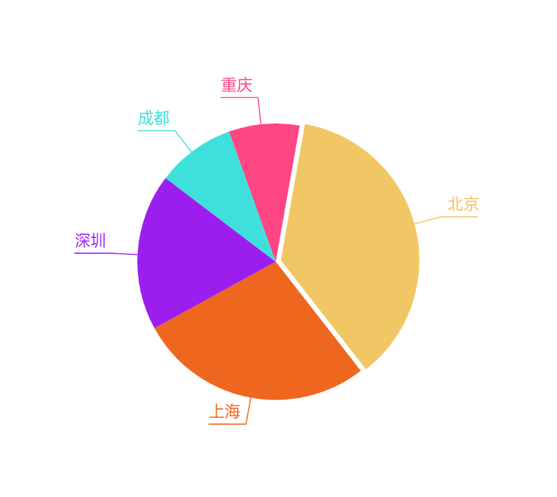

# PieChartView
自定义饼图统计、点击监听
# 预览

# 资源
|名字|资源|
|-|-|
|AAR|[pie_chart_view.aar](https://github.com/RelinRan/PieChartView/blob/master/pie_chart_view_2022.7.21.1.aar)|
|GitHub |[PieChartView](https://github.com/RelinRan/PieChartView)|
|Gitee|[PieChartView](https://gitee.com/relin/PieChartView)|
# Maven
1.build.grade | setting.grade
```
repositories {
	...
	maven { url 'https://jitpack.io' }
}
```
2./app/build.grade
```
dependencies {
	implementation 'com.github.RelinRan:PieChartView:2022.7.21.1'
}
```
# xml
~~~
<androidx.widget.PieChartView
   android:id="@+id/pie_chart"
   android:layout_width="match_parent"
   android:layout_height="wrap_content" />
~~~
# attrs.xml
~~~
<!--半径缩放比例-->
<attr name="radiusScale" format="float" />
<!--文字拐角间距-->
<attr name="textCornerMargin" format="dimension" />
<!--饼图指线长度-->
<attr name="pieLineWidth" format="dimension" />
<!--饼图文字大侠-->
<attr name="pieTextSize" format="dimension" />
<!--选中偏移量-->
<attr name="checkedOffset" format="dimension" />
~~~
# 使用
~~~
PieChartView pie_chart = findViewById(R.id.pie_chart);
//数据源
List<Pie> data = new ArrayList<>();
data.add(new Pie("北京",800, Color.parseColor("#F1C664")));
data.add(new Pie("上海",600, Color.parseColor("#EF671E")));
data.add(new Pie("深圳",400, Color.parseColor("#9C1EEF")));
data.add(new Pie("成都",200, Color.parseColor("#3EE0DB")));
data.add(new Pie("重庆",180, Color.parseColor("#FF4683")));
pie_chart.setDatasource(data);
//点击事件
pie_chart.setOnPieChartItemClickListener((v, position) -> {
    Pie pie = v.getItem(position);
});
~~~
